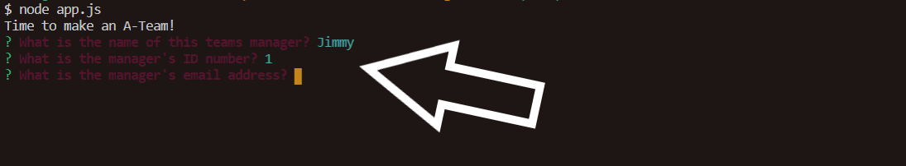
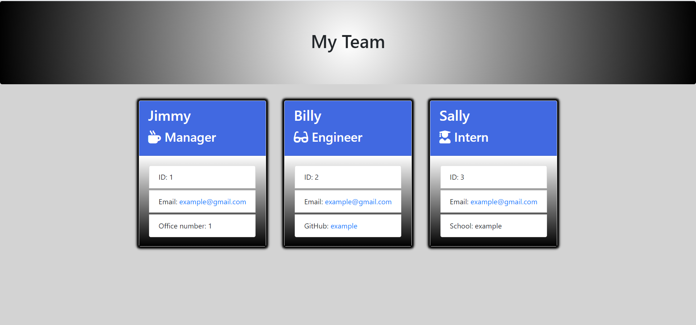

# Coding Team Generator

## Overview:
The team generator allows you to easily create an HTML webpage that displays a coding team.  Each member of the team will have their information displayed on the page.  The info displayed changes based on the role of the member ex. Manager, Engineer, or Intern.  This was primarily accomplished using class constructors, node, inquirer, fs, and bootstrap.  

### Table of Contents:
1. [How it works](#How-it-works)
2. [Example](#Example)
3. [Installation](#Installation)
4. [Test](#Test)
5. [Contributing](#Contributing)
6. [Questions](#Questions?)
7. [License](#License)

### How it works!
Simply run the command node app.js in your command line.  After that add team members to your page by answering the questions.  Once your team is complete answer no to if you want to add another team member and your HTML page will be created and located in the output folder!

### Initiate Prompt Questions
      

### Add Team Members
      

### Open HTML File in output Folder
     

### Example
Here is a link to the Coding Team Generator:  [https://github.com/vfavorito/team-generator](https://github.com/vfavorito/team-generator)

### Installation
Clone the Repository onto your local machine.  Make sure you have node installed then run the command npm i in your terminal to install all of the package files.  After that you are good to go.

### Test
Make a team of your own!

### Contributing
If you would like to contribute to the development of this app the guidelines for doing so can be found here: [Contribution Covenant](https://www.contributor-covenant.org/version/2/0/code_of_conduct/code_of_conduct.txt)

### Questions?
Visit my Github profile here: [vfavorito](https://github.com/vfavorito) 
If you have any questions you can reach out to me at vince.favorito@gmail.com

### License
This App is covered under the MIT License